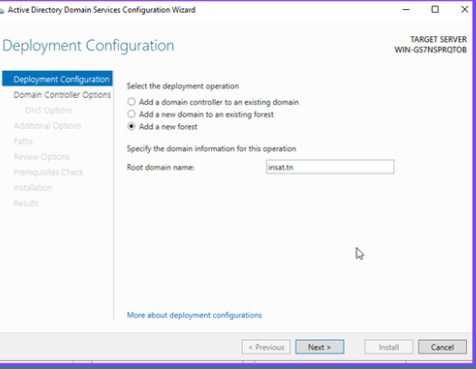
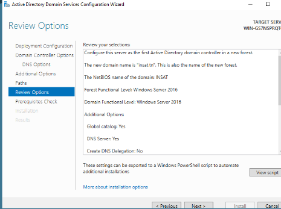
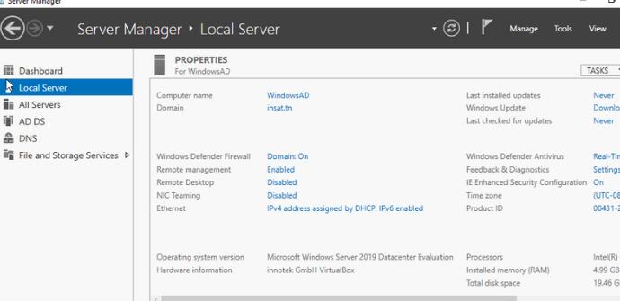
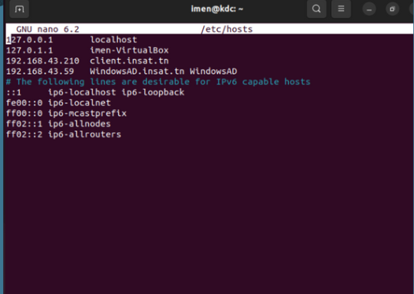
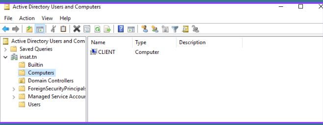

# Connecting Linux Machine to Active Directory using Kerberos Authentication

This guide will walk you through the process of connecting an machine Linux to an Active Directory (AD) domain using Kerberos authentication. This will allow users on the Ubuntu machine to log in using their AD credentials.

## Kerberos: The Secret to Streamlining Your Network Login Process
Are you tired of juggling multiple usernames and passwords for different services on your network? Look no further than Kerberos, a powerful security protocol that simplifies authentication and enables single sign-on capabilities.

With Kerberos, users can securely authenticate themselves to various services on a network without having to constantly re-enter their credentials. How does it work?
#### 1.The user tries to access a network resource, such as a file or an application.He sends a request to the Kerberos Authentication Server (KAS) to get a ticket for the user to access the network resource.
#### 2.The KAS checks to see if the user is authorized to access the network resource. If the user is authorized, the KAS creates a ticket-granting ticket (TGT) for the user and sends it back to the client machine.
#### 3.The client machine sends the TGT to the Kerberos Ticket Granting Server (KTGS) to get a service ticket for the specific network resource that the user is trying to access.
#### 4.The KTGS checks to see if the TGT is valid and if the user is authorized to access the network resource. If the TGT is valid and the user is authorized, the KTGS creates a service ticket for the user and sends it back to the client machine.
#### 5.The client machine sends the service ticket to the server machine hosting the network resource.
#### 6.The server machine checks to see if the service ticket is valid and if the user is authorized to access the network resource. If the service ticket is valid and the user is authorized, the server machine allows the user to access the network resource.

## Prerequisites

Before getting started, you will need the following:

- An Ubuntu machine with administrative privileges
- A Windows Active Directory domain
- A user account in the Active Directory domain with administrative privileges

## Step 1: Create a Kerberos realm by setting up Active Directory
To begin, we need to install and configure Active Directory on a Windows Server. This involves creating a new **forest**:A collection of one or more Active Directory domains **domain** :A logical grouping of resources, users, and computers in a network , and **domain controller**:A server that is responsible for authenticating users and computers in that domain., which will serve as our KDC. Once we have our KDC set up, we can create a Kerberos realm by specifying the realm name and the KDC's hostname and IP address.
   
 <p align="center"></p>                                                   

Next, we need to configure our Linux client machine to resolve the AD domain name. We can do this by editing the **/etc/hosts** file on the client and adding an entry for the KDC's hostname and IP address. This will ensure that our client can communicate with the KDC and authenticate users against the Kerberos realm

<p align="center"></p>

## Step 2: Join Ubuntu Machine in AD

1. Install Kerberos client: To join the Ubuntu machine to the AD domain, we need to install the Kerberos client on the Ubuntu machine. This can be done using the following command:

   ```
   sudo apt-get install krb5-user
   ```

2. Modify kerb5.conf file: After installing the Kerberos client, we need to configure it to work with our AD domain. We do this by modifying the `krb5.conf` file. Open the file `/etc/krb5.conf` using a text editor and replace its contents with the following:

   ```
   [libdefaults]
       default_realm = INSAT.TN

   [realms]
       YOUR-REALM-NAME = {
           kdc = WindowsAD.insat.tn
           admin_server = WindowsAD.insat.tn
           default_domain = WindowsAD.insat.tn
       }
   ```

3. Create TGT administrator: Before we can join the Ubuntu machine to the AD domain, we need to authenticate as an administrator who has permissions to join machines to the domain. To do this, we need to create a TGT (Ticket Granting Ticket) for the administrator. Use the following command to create the TGT:

   ```
   kinit administrator@WindowsAD.insat.tn
   ```

4. Join discovery: Now that we have the Kerberos client installed and configured, and we have a TGT for the administrator, we can join the Ubuntu machine to the AD domain. We do this using the `realm join` command. The `--user-principal` option specifies the user principal to use for joining the domain (in this case, the administrator account), and the `--install=/` option specifies the location to install the integration files.

   ```
   sudo realm join -U=WindowsAD.insat.tn
   ```
 Now the client machine has successfully joined your Ubuntu machine to the AD domain using Kerberos authentication.
 <p align="center"></p>
Sure, here's an example of how you could explain the process of logging in to the Ubuntu machine with AD credentials using SSSD and PAM:

## Step 3: Logging in with AD Credentials using SSSD and PAM

Now that we have joined the Ubuntu machine to the Active Directory domain and installed the Kerberos client, we can proceed to adding an AD user and logging in with their credentials. To do this, we will use the System Security Services Daemon (SSSD) and Pluggable Authentication Modules (PAM).

SSSD is a service that provides a way for Linux systems to access identity and authentication providers, including Active Directory. It is able to cache user credentials locally, allowing for offline authentication, and can also perform user lookups and group membership queries against Active Directory.

PAM is a system for authenticating and authorizing users on a Linux system. It provides a way for system administrators to configure various authentication and authorization modules that can be used to control access to system resources.

To configure SSSD and PAM to allow AD users to log in to the Ubuntu machine, follow these steps:

1. Install the SSSD and PAM packages by running the following command:
```
sudo apt-get install sssd libpam-sss libnss-sss
```

2. Modify the SSSD configuration file (/etc/sssd/sssd.conf) to specify the AD domain information and configure the local user and group lookups. Here's an example configuration file:

```
[sssd]
config_file_version = 2
services = nss, pam
domains = mydomain.com

[nss]
filter_users = root
filter_groups = root

[pam]
offline_credentials_expiration = 2

[domain/mydomain.com]
id_provider = ad
auth_provider = ad
chpass_provider = ad
access_provider = ad
ad_server = ad-server.mydomain.com
ad_domain = mydomain.com
krb5_realm = MYDOMAIN.COM
krb5_store_password_if_offline = True
default_shell = /bin/bash
fallback_homedir = /home/%u@%d
```

This configuration file specifies the domain (mydomain.com), the AD server, and various other options, including the default shell and home directory format.

3. Restart the SSSD service by running the following command:
```
sudo systemctl restart sssd
```

4. Add an AD user to the Ubuntu machine by running the following command:
```
sudo useradd -m -s /bin/bash imen@insat.tn
```

This will create a new user with the username "aduser" and a home directory in /home/aduser.

5. Set the AD user's password using the "kinit" command to obtain a Ticket Granting Ticket (TGT) for an Active Directory administrator account. Run the following command:
```
kinit administrator@mydomain.com
```

Enter the Active Directory administrator's password when prompted.

6. Switch to the AD user's account using the "su" command. Run the following command:
```
sudo su imen@insat.tn
```

That's it! You have successfully logged in to the Ubuntu machine using an Active Directory user account.
To enable Active Directory users to access their home directory upon login, run the following command:
```
sudo pam-auth-update --enable mkhomedir
```
This command adds the necessary PAM (Pluggable Authentication Modules) configuration to create the user's home directory upon first login.
<p align="center"></p>

## Conclusion

In conclusion, configuring a Linux machine to connect to Active Directory using Kerberos authentication is a great way to centralize user authentication and authorization management. However, it's important to be aware that any misconfiguration or vulnerability in the PAM and SSSD configuration files can potentially allow unauthorized access to the system. 

To mitigate these risks, it's recommended to follow best practices when configuring PAM and SSSD, such as ensuring proper file permissions and using secure authentication methods. Regularly reviewing the logs and monitoring the system for suspicious activity can also help detect and prevent any potential security threats.
